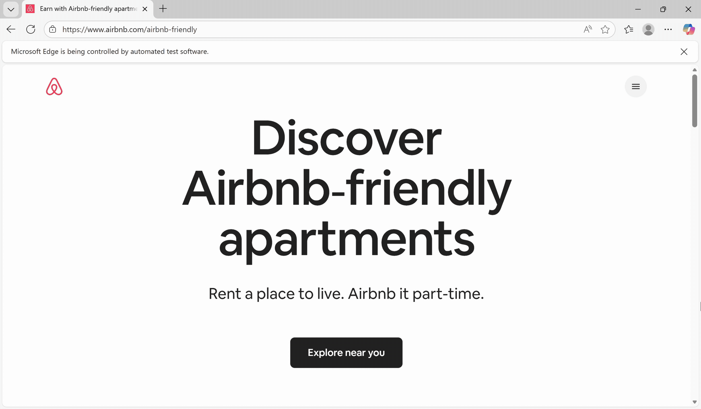
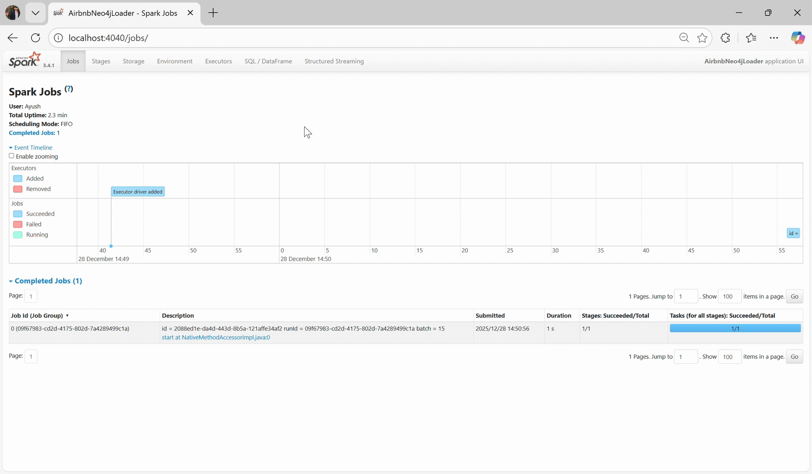
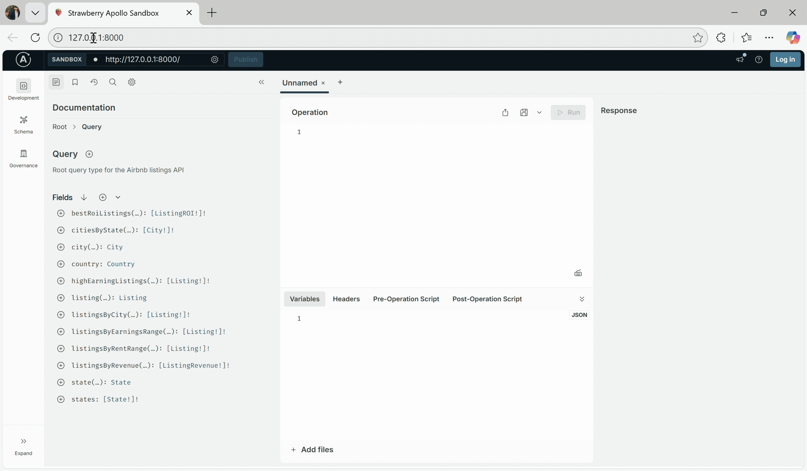

# Airbnb Earnings GenAI App

<p align="center">
  
</p>

Welcome to a walkthrough detailing the steps to develop an interactive AI assistant powered by a real-time data streaming pipeline, a graph-based storage engine, as well as a conversational AI agent -- **all in Python!**

Yes, that's right, the ETL layer to extract the data, the API & data layer to model the relational data, the backend ReAct agent equipped with different tools & the UI chat interface are all built following Pythonic standards.

This tutorial aims to empower other developers to build an app with a similar stack that is meaningful to them & future users. 
One should feel free to use their own data of interest to expand on and to generate live insights. 

**The code for this project is not yet open-source.**

## Architecture Overview


## Motivation
As an Airbnb host myself as well as an avid user of Airbnb when looking for rentals during travel stays, I'm always on the lookout for the best prices. I often monitor market trends in the same area I host my timeshare to give competitive rates to renters, but I also hope to expand my host properties around the country.

My aim was to find a listings site showcasing the hottest trends on property listings. It's a good thing that Airbnb has a [page](https://www.airbnb.com/airbnb-friendly) for this. However, some problems I had included manually searching the listings, as well as not being able to easily get the data in a central forum via a public data API or purchasable dataset.

As a developer, I wanted to build something that would streamline this process of market analysis to then give me up-to-date intelligent recommendations & investment opportunities. We've all at one point had a "Fine, I'll do it myself" moment, and this situation marked a time where I had to take matters into my own hands. 

**Soon in this tutorial, we'll go through how I was able to automate the daily extraction of listings from Airbnb's Friendly webpage to later present the data on demand in a conversational AI app.** Let's get started!

## Quick Start

### Prerequisites
- **Python 3.1x**
- **Docker Engine** (Running on a highly available server)
- **Selenium WebDriver** (MS Edge browser used)
- **Apache Kafka** 
- **Apache Spark** (w/ Spark Structured Streaming)
- **Neo4j Instance** (AuraDB managed cloud service used)
- **Strawberry GraphQL** (via FastAPI & Apollo Sandbox)
- **MLflow**
- **Streamlit**
- **LLM API Key** (OpenAI w/ LangChain used)

### Learning Links

[Structured Streaming + Kafka Integration Guide](https://spark.apache.org/docs/latest/streaming/structured-streaming-kafka-integration.html)

[Neo4j Spark Structured Streaming](https://neo4j.com/docs/spark/current/streaming/)

[Intro to GraphQL with Python and Strawberry Course](https://www.apollographql.com/tutorials/intro-strawberry)

[LangChain GraphQL Integration](https://docs.langchain.com/oss/python/integrations/tools/graphql)

[LangChain-based GraphRAG Workflow](https://neo4j.com/blog/developer/neo4j-graphrag-workflow-langchain-langgraph/)

[Build a Neo4j-backed Chatbot using Python, LangChain & Streamlit](https://graphacademy.neo4j.com/courses/llm-chatbot-python/)


### Environment Setup

**Sample Project Structure**
```
AirbnbEarningsGenAIApp               
├── 📁 .streamlit             
│   └── 📄secrets.toml               
├── 📁 api
│   ├── 📄__init__.py                                
│   ├── 📄main.py               
│   ├── 📄mutation.py             
│   ├── 📄neo4j.py              
│   ├── 📄query.py
│   ├── 📄schema.py       
│   └── 📄types.py              
├── 📁 chat
│   ├── 📄__init__.py                                                
│   ├── 📄agent.py              
│   ├── 📄bot.py
│   ├── 📄graph.py                          
│   ├── 📄llm.py
│   ├── 📄utils.py                              
│   ├── 📁 tools
│       ├── 📄__init__.py                                        
│       ├── 📄cypher.py      
│       └── 📄graphql.py         
├── 📁 etl
│   ├── 📄__init__.py                                                  
│   ├── 📄scheduler.py          
│   ├── 📄scraper.py           
│   └── 📄streamer.py
├── 📁 tests          
├── 📄Dockerfile                
├── 📄README.md          
└── 📄requirements.txt                
```

**List Python packages in ```requirements.txt``` file in project directory**
```text
fastapi==0.115.12
findspark==2.0.1
gql==4.0.0
kafka-python==2.2.15
langchain>=0.3.25
langchain-community==0.3.25
langchainhub==0.1.21
langchain-neo4j==0.1.1
langchain-openai==0.2.10
mlflow==3.4.0
neo4j==5.27.0
openai==1.56.0
pyspark==3.4.1
pytest==8.1.1
requests==2.32.4
schedule==1.2.2
selenium==4.35.0
strawberry-graphql>=0.213.0
streamlit==1.35.0
tenacity!=8.4.0
uvicorn==0.34.3
```

**Setup virtual environment**

Before installing the dependencies, let's set up a virtual environment to keep our project dependencies isolated from other projects:
```bash
python -m venv .venv
```

**To activate the environment (Linux), run:**
```bash
source .venv/bin/activate
```

**Install dependencies**
```bash
pip install -r requirements.txt
```

### Configuration Setup
Since we know we want to use Streamlit as our UI for conversational app, we can take advantage of its ```secrets.toml``` file and use it to manage all of our projects' environment variables.

**Streamlit Secrets**
```toml
OPENAI_API_KEY = "OPENAI_API_KEY"
OPENAI_MODEL = "OPENAI_MODEL"  # e.g. gpt-4o-mini

NEO4J_URI = "NEO4J_URI"  # e.g. neo4j+s://your-instance.databases.neo4j.io
NEO4J_USERNAME = "NEO4J_USERNAME"  
NEO4J_PASSWORD = "NEO4J_PASSWORD"

KAFKA_BROKER = "KAFKA_BROKER"  # e.g. localhost:9092
KAFKA_TOPIC = "KAFKA_TOPIC"
CHECKPOINT_PATH = "CHECKPOINT_PATH"  # e.g. s3a://{bucket}/{directory}

WEB_DRIVER_PATH = "WEB_DRIVER_PATH"
WEB_URL = "WEB_URL"  # e.g. https://www.airbnb.com/airbnb-friendly
```

### Manual Infrastructure Setup

For the sake of simplicity, we will follow the manual setup steps below to start running the services on a server that the app is dependent on. Feel free to use Docker Compose here as well if you please!

| Service | Port | Description |
|---------|------|-------------|
| **Spark Web UI** | 4040 | Monitor Spark application |
| **Kafka Web UI** | 8080 | Kafka cluster visualization |
| **Zookeeper** | 2181 | Kafka coordination service |
| **Kafka** | 9092 | Message streaming platform |
| **GraphQL API** | 8000 | Strawberry Apollo Sandbox |
| **Streamlit** | 8501 | Interactive chat interface |
| **MLflow** | 5000 | GenAI apps & agents tracing |


#### Useful commands  

**1. Start Apache Kafka**
```bash
# Terminal 1: Start Zookeeper
cd /path/to/kafka
bin/zookeeper-server-start.sh config/zookeeper.properties

# Terminal 2: Start Kafka Server
bin/kafka-server-start.sh config/server.properties

# Terminal 3: Start Kafka UI (Docker)
# To monitor Kafka topic and its produced messages, we will use the pre-built Docker image to run Apache Kafka UI:
docker run -it -p 8080:8080 -e DYNAMIC_CONFIG_ENABLED=true provectuslabs/kafka-ui
```

**2. Start GraphQL API**
```bash
python -m api.main
```

**3. Start Streamlit App**
```bash
streamlit run chat/bot.py
```

**4. Start MLflow**
```bash
mlflow ui
```


## ETL Layer

### Extract
We first need to decide on a data scheduler that will periodically, in this case daily, scrape our target Airbnb web page to make sure we are getting the most recent data for our GraphRAG application. For this demo we are just using an inherent Python scheduler which uses CRON-based expressions to achieve our goal. One also has the option to use modern tools like Airflow, Dagster, Prefect or Mage. 

We now need to focus on the scraping of data from the Airbnb Friendly webpage. Before moving one, one needs to [download](https://developer.microsoft.com/en-us/microsoft-edge/tools/webdriver) the latest driver compatible with the local Edge installation. Again, Chrome or Firefox can be used here instead.

Here, it is crucial to keep in mind the 'Developer Tools' that help us inspect the HTML page with DOM elements presented as a tree structure of interconnected nodes. Below is a quick demo detailing that specific elements could look like on a specific citys' listings:


As a general guideline, the hierarchy shows that ```<div>``` tags group our HTML elements into sections, while the ```class``` & ```href``` attributes contain the text or destination URLs we want to strip. To integrate these principles together, understanding XPath Axes & Selenium's web elements are crucial. Some helpful links I used to brush up on my foundations are:

[Selenium Web Elements](https://www.selenium.dev/documentation/webdriver/elements/)

[XPath Axes](https://www.scientecheasy.com/2019/08/xpath-axes.html/)

**Hint:** I only had to use 'following-sibling' & 'ancestor' axes to get the XPath of element nodes containing the target data I needed!

Once done, you can expect your Selenium code to extract all Airbnb listing data from each city available. Here is what our WebDriver will be automated to do for us in real-time:




### Transform

Now that we have our data organized in a way that's easy to parse, we can produce our data as message records so Kafka can queue it, then we will use Spark Structured Streaming to consume those messages and output it to Neo4j. 

Our justification to use a real-time data streaming pipeline is to handle large records of data, especially if this project increases in scope and we decide to scrape listings in other countries outside of the US. If one doesn't feel the need to uses streaming technologies and prefers to directly write the scraped data to Neo4j, a [Python-Neo4j](https://pypi.org/project/neo4j/) connector allows for exactly that.

When the streaming pipeline runs daily, the checkpoint location (a path in an HDFS-compatible storage system) may cause some challenges we need to **keep in mind**:

1. Data loss
2. Topic resets
3. Checkpoint offsets

Here is a comprehensive [article](https://dev.to/kevinwallimann/how-to-recover-from-a-kafka-topic-reset-in-spark-structured-streaming-3phd) I referenced when needing to come up with solutions to those potential roadblocks. 

In each iteration of the daily streaming pipeline, it's a good practice to first re-create & delete the Kakfa topic before producing new incoming data, then re-start the Spark Streaming query consuming that data so each microbatch starts with an offset of 0. Additionally, some further configurations to set in the code as a best practice are:

| Client | Configuration |
|---------|------|
| **Kafka Producer** | enable_idempotence=True | 
| **Spark Consumer** | startingOffsets="latest" |
| **Spark Consumer** | failOnDataLoss="false" | 

In order for Spark Structured Streaming to be able to consume messages from Kakfa topic & to also write to Neo4j, we first need to make sure we have the correct JARS placed in Spark's classpath. These JARS are dependent on the Apache Spark & Kafka versions you are using and can be downloaded from Maven Central:

```
spark-streaming_2.1x-3.x.x.jar
spark-streaming-kafka-0-10_2.1x-3.x.x.jar
spark-sql-kafka-0-10_2.1x-3.x.x.jar
kafka-clients-3.x.x.jar
spark-token-provider-kafka-0-10_2.1x-3.x.x.jar
commons-pool2-2.1x.x.jar
neo4j-spark-connector-5.3.9-s_2.1x.jar
```

We can monitor the messages produced to the Kafka topic using its Web UI:


We can also monitor the running Spark Streaming session in its respective Web UI:



We are now ready to write our data to Neo4j using Cypher queries via Graph Query Language (GQL)!


### Load

Once we properly identify our nodes with their properties & relationships via a Cypher query to create our graph database model, we can have Spark write the data stream to our Neo4j AuraDB instance. This will kickstart progress on introducing a GraphRAG system that uses Neo4j as a knowledge graph to provide more accurate & relevant results to our GenAI application based on relationships between the data nodes.

**Graph Visualization Overview:**
<p align="center">
   
</p>

**Subgraph w/ Sample Nodes & Relationships:**


A summary of the graph database model the above images illustrate:

**Node Structures**

| Node Type | Properties | Description |
|-----------|------------|-------------|
| **Country** | `name: String` | Represents a country (e.g., "United States") |
| **State** | `code: String` | Represents a state (e.g., "CA", "NY") |
| **City** | `name: String`<br>`state: String` | Represents a city with its state |
| **Listing** | `name: String`<br>`address: String`<br>`monthly_rent: Integer`<br>`weekly_earnings: Integer` | Represents an Airbnb listing with financial metrics |

**Relationships**

| Relationship | Direction | From → To | Description |
|--------------|-----------|-----------|-------------|
| **HAS_STATE** | `→` | Country → State | Country contains states |
| **HAS_CITY** | `→` | State → City | State contains cities |
| **HAS_LISTING** | `→` | City → Listing | City contains listings |


## API & Data Layer

Now we can move on to creating a single GraphQL endpoint that will seamlessly enable one to retrieve data with a single query. This is opposed to using & navigating multiple REST API endpoints on the client side where there can be large response data.

Strawberry integrates with FastAPI to give that endpoint and allows us to create resources that need to be shared across requests. We use context managers to provide the Neo4j driver to GraphQL resolvers. If we define resolvers for fields of the Query type, these fields become the entry point into the GraphQL schema.

The schema is a collection of types & fields written in schema definition language (SDL), and once created the resolver can retrieve data for a specific field in the schema. Strawberry translates Python types into GraphQL SDL in the background.

Once we find all properties of a class defined as a type, a field can be resolved with a specific function. Then we can use the Apollo Sandbox IDE to validate the GraphQL schema we've created with different types & fields as shown:



Some of the query operations focus on ROI, highest earnings by revenue, listings that fall within a certain range, just to name a few. This GraphQL web IDE allows us to become more familiar with our query operations. Next we will talk more about how those resolver functions are helpful in a GraphRAG workflow for a GenAI app hosted on Streamlit.

## Conversational UI

We will create a Streamlit app that will interact with an OpenAI LLM through an agent. A list of tools with prompt templates need to be passed to the agent for it to then generate a response to a user's input in UI. 

We specifically only work with LangChain here and not LangGraph because we want to take advantage of Neo4j's chat message history storage. This is what allows for a conversation history via the use of callback functions & stored session IDs, giving the agent a memory of recent messages. 

We can either create a ReAct agent using a pre-existing RAG prompt template from [LangSmith](https://smith.langchain.com/hub/rlm/rag-prompt), provide our own custom prompt template, or include a general prompt template dedicated for chat models. In either case, we always need to specify the LLM, tools & type of prompt when creating the ReAct agent.

Some sample tools registered & passed to our agent include:

1. An Airbnb general chat chain to fallback on when no other tool is available for the agent
2. A Graph Cypher QA Chain to execute direct Cypher queries against Neo4j
3. A custom Smart NLP text parser using existing resolver functions in GraphQL endpoint
4. LangChain's [BaseGraphQLTool](https://docs.langchain.com/oss/python/integrations/tools/graphql) to allow agent to generate & execute queries based on GraphQL API endpoint

A sample user input & agent response is shown below:


We can enable tracing for our application to visualize the data flow with [MLflow's LangChain integration](https://docs.langchain.com/oss/python/integrations/providers/mlflow_tracking). In the Traces tab, we can see the reasoning flow of the agent after it parses the user input. The tool show below is identified by the name given to it during initialization in the backend code:


**Tip:** If one ever encounters memory errors in the Streamlit application, some fine-tuning techniques involve reducing model token limits, lowering the temparature for more factual responses and adding timeout durations for requests in the LLM's initialization.


## Future Considerations

As this project keeps growing, we look to enhance the Streamlit app with cosmetic changes and eventually deploy to its Community Cloud so users can interact with it over the Internet. This would also require hosting the GraphQL server publicly with either AWS AppSync or Neo4j AuraDB's Data API service.

Stay tuned for updates!
